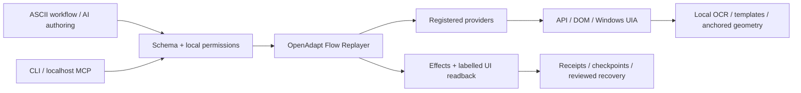

# L1ght5p33d

[](https://github.com/HiTecHelpLLC/l1ght5p33d/actions/workflows/l1ght5p33d-ci.yml)

**Create, discover, adapt, combine and run reusable computer workflows.**

L1ght5p33d extends OpenAdapt Flow with a local workflow library, application
adapters and controls for people and AI systems. It handles repetitive work in
browsers and Windows desktop software. AI helps author, find, parameterize,
inspect and repair workflows; routine execution makes **zero model calls**.
Instructions are versioned ASCII JSON files you can edit, share and run without AI.

BandLab MIDI importing is the first reference integration, not the product's
scope. A browser poster workflow and Windows creative-brief workflow demonstrate
the same application-independent core. More workflows belong in the library;
new applications belong behind adapters, without changing the execution engine.

The preview discovers workflows installed in a local directory. Optional signed
catalogs let you find versioned workflows and download them through a local IPFS
node. THEBEST is the proposed public register; its default-disabled integration
is included for operator deployment. Existing SoundFlow, REAPER or n8n recipes
still require their own runner or an explicit integration. See
[creating and sharing a workflow library](docs/workflow-library.md).

**v0.1.0 developer preview, Windows 11 first.** Production-oriented controls are
implemented, but this is not a blanket production qualification. The complete
BandLab path is tested against a local functional fixture; live Studio selectors
still need operator calibration. Native input requires an interactive foreground
window. See [acceptance and limits](docs/acceptance.md).

## Windows quick start

Install Python 3.12 and Git, then run in PowerShell:

```powershell
git clone https://github.com/HiTecHelpLLC/l1ght5p33d.git
cd l1ght5p33d
.\scripts\install-l1ght5p33d.ps1
.\packages\l1ght5p33d\.venv\Scripts\python.exe -X utf8 -m l1ght5p33d demo browser
.\packages\l1ght5p33d\.venv\Scripts\python.exe -X utf8 -m l1ght5p33d demo bandlab
```

The installer uses the committed transitive `uv.lock` and downloads Chromium
once. The demos use synthetic content and local servers. Add `--headful` to watch.
`demo windows` opens the synthetic desktop fixture; focus it when prompted.
The CLI activates UTF-8 mode automatically on Windows for upstream checkpoints.

Releases contain a wheel, sdist and Windows developer-preview ZIP. No Python or
browser binary is bundled. `python -m pip install <downloaded-wheel>` also works
under Python 3.12; use the ZIP installer for the fully locked dependency set.
The package is not yet published to PyPI.

## Current capabilities

- Variables, typed parameters, graph conditions, bounded loops, subflows, effect
  assertions and exception paths through the existing OpenAdapt Flow runtime.
- CLI and localhost MCP: discover, validate, run, step, pause, resume, abort,
  inspect receipts, and propose a readable workflow patch.
- AI-facing search and inactive download from operator-pinned catalogs; complete
  per-run plans with explicit local human confirmation, single-use approval and
  revalidation of inputs. See [workflow review](docs/workflow-review.md).
- Playwright role/label selectors, explicit fallback chains and dedicated Chrome
  or Edge profiles. Input delivery and verified outcomes are separate facts.
- Windows UIA with exact executable/PID/HWND/title/DPI/display/foreground checks;
  local OCR and template matching when semantic controls are absent.
- Local MIDI tempo/time-signature/type/channel/program/track/note analysis,
  heuristic classification, source hashes and reviewable manifests.
- BandLab ordered import, track naming/instruments, reference WAV/offset/mute,
  tempo, save and receipts, proven against the functional fixture.
- SDK recovery from reviewed native pending checkpoints, rechecking previous
  effects before continuing. Uncertain imports are not blindly retried.
- Signed workflow catalogs with exact-version, hash-checked P2P retrieval through
  optional Kubo. Installed files need separate local execution approval.

Runs write text logs, JSONL receipts, status, sealed bundles and native Flow
reports/checkpoints beneath `%LOCALAPPDATA%\L1ght5p33d`. GUI readback is labelled
`completed_ui_verified`; it is not independent proof of remote persistence.
Interrupted or uncertain runs remain halted/aborted.

## Architecture and prior art

This is a **history-preserving downstream fork of
[OpenAdapt Flow](https://github.com/OpenAdaptAI/openadapt-flow)**. Its original MIT
copyright and source are retained. The creator extension is separately packaged
under [`packages/l1ght5p33d`](packages/l1ght5p33d); inherited source remains in
`openadapt_flow`. The extension pins the published Flow 1.34.0 wheel. The retained
source snapshot was preparing 1.35.0; tests deliberately import the released wheel.



Playwright, pywinauto, OpenCV/RapidOCR, Mido and the official MCP Python SDK supply
specialized capabilities. No new general automation interpreter was built.
Native ASCII JSON preserves one identity/effect/resume model; Robot Framework
was spiked but a second interpreter was rejected. Read the
[prior-art report](docs/prior-art.md), [ADR](docs/adr/0001-extend-openadapt-flow.md)
and [technical spikes](docs/l1ght5p33d/technical-spikes.md).

[THEBEST register and P2P distribution](docs/adr/0002-thebest-register-and-p2p.md)
add optional discovery and transport around that runtime. No new P2P engine is
built, and ordinary local workflows need neither a registry nor an IPFS node.
The [registry operator guide](docs/registry-operations.md) covers publication,
signing, explicit seeding and the default-disabled THEBEST integration.

## Editable workflows

Examples live in [`examples/l1ght5p33d`](examples/l1ght5p33d). Each action names
a registered provider, selector chain, variables and expected effect. The full
[workflow specification](docs/l1ght5p33d/workflow-spec.md) explains native graphs,
includes, conditions, recovery and the versioned envelope.

With the virtual environment activated:

```powershell
l1ght5p33d validate .\workflows\my-workflow.json
l1ght5p33d approve-workflow .\workflows\my-workflow.json --policy .\policy.private.json
l1ght5p33d run .\workflows\my-workflow.json --policy .\policy.private.json --dry-run
l1ght5p33d run .\workflows\my-workflow.json --policy .\policy.private.json --var title="My poster"
```

Review the file before issuing its exact local digest grant. CLI-generated
synthetic demos grant only their own generated workflow for that run.

## AI control and privacy

```powershell
l1ght5p33d serve --workflows .\workflows --policy .\policy.private.json
```

Connect an MCP client to `http://127.0.0.1:7331/mcp` with an Authorization bearer
header containing the private session token. The CLI prints the token file's
location, never its contents. Host/Origin validation and bounded requests protect
the loopback service. `l1ght5p33d rpc` offers local line-oriented JSON-RPC.
See [interface documentation](docs/mcp.md).

Screenshots stay local and are not returned by the creator MCP tools. No model,
cloud telemetry or paid provider is configured. Users enter credentials only in
the application's normal login UI. Credential-bearing workflow parameters are
refused in this preview because upstream durable metadata is not a secret store.
Profiles, calibration, images and receipts stay outside Git by default.

Workflow files cannot import Python, execute a shell, register code or grant
filesystem/application access. Installed providers are trusted code, not sandboxed
plugins. Executable edits require local approval; remote patch approval cannot
expand that authority. One automation run may be active per service. Account
creation, purchases, social engagement, publishing and distribution are outside
the provided BandLab adapter.

## BandLab reference

```powershell
l1ght5p33d midi C:\MyMidi --out manifest.json --reference-wav C:\MyMidi\reference.wav
l1ght5p33d bandlab-login --profile bandlab --channel chrome
```

Review the manifest, then follow the manual live-validation command in
[the BandLab guide](docs/bandlab.md). Classification is heuristic; audio-derived
MIDI is not ground-truth instrumentation. Source files are not modified and
quantization is not applied automatically. Track limits, mappings, order, naming
and alignment are editable. Unsupported live widgets stop for review.

The fixture proves the intended sequence, not today's private BandLab DOM.
Automatic hard-crash reconstruction, an integrated recorder-to-provider compiler,
broader native app qualification and a plugin marketplace remain
[roadmap](docs/ROADMAP.md) items.

## Development

```powershell
.\scripts\install-l1ght5p33d.ps1 -Developer
cd packages\l1ght5p33d
.\.venv\Scripts\python.exe -X utf8 -m pytest -q
.\.venv\Scripts\ruff.exe check src tests
.\.venv\Scripts\ruff.exe format --check src tests
.\.venv\Scripts\mypy.exe
```

Windows/Linux CI runs tests, real browser fixtures, clean-wheel first runs,
formatting, typing, Gitleaks, vulnerability/license scans, and actual archive
inspection. Interactive native input has a separate qualification command.
Upstream deployment workflows are preserved in `.github/upstream-workflows`.

See [contributing](CONTRIBUTING.md), [adapter guide](docs/adapter-development.md),
[recorder/calibration](docs/recorder-calibration.md), [troubleshooting](docs/troubleshooting.md),
[security](SECURITY.md), [conduct](CODE_OF_CONDUCT.md), [license](LICENSE), and
[third-party notices](THIRD_PARTY_NOTICES.md). Inherited repository-only AGPL
benchmark material is excluded from creator distributions.

L1ght5p33d is unofficial and unaffiliated with OpenAdapt, BandLab, Suno,
Microsoft or any automated application. Product names belong to their owners;
no endorsement is implied.
