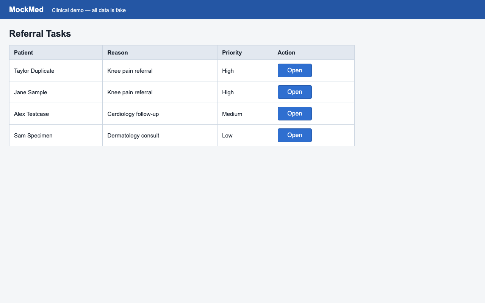

# ❌ mockmed-triage — HALTED

- **Started:** 2026-07-25T19:27:50.319890+00:00
- **Execution profile:** `standard` (not production-eligible)
- **Required contracts passed:** authorization 1/1, identity 0/1, postcondition 0/2
- **Evidence classes:** `authorization`
- **Model calls:** 0
- **External network calls:** `observed`
- **Steps:** 0/1 ok
- **Heals:** 0
- **Screenshot egress:** none observed (zero screenshots left the box)
- **Governed authorization:** `3cdf6a61d3964518ad830fbe23a59b12` (public-demo-qualified-campaign)
- **Admitted policy:** clinical-write; runtime inputs bound to `342463e1dfa0e45e5a5dac4c34a3daf2f1499aeeb2fa7eefeb8f0a9a027b3ea1`

## Parameters

| Param | Value |
| --- | --- |
| `note` | Synthetic follow-up in two weeks |

## Identity protection coverage

**5 of 5 click steps identity-armed.** Unarmed clicks proceed with **no identity verification** (see docs/LIMITS.md).

## Effect verification (system of record)

_No executed step carried a system-of-record effect contract — every local step outcome used screen evidence only. Run `openadapt-flow lint` to see the bundle's consequential-step effect coverage._

## Steps

| # | Step | Intent | Rung | Confidence | Verified | ms | Healed | OK |
| --- | --- | --- | --- | --- | --- | --- | --- | --- |
| 1 | `step_000` | click 'Open' | template | 1.00 | id ✗ | 154 |  | ❌ |

## Per-step evidence

Every step below shows the frame **before** and **after** the action next to the resolution rung, the identity-gate and effect-check verdicts, and whether the step healed or halted. The generator links only retained run artifacts and never synthesizes pixels. If image redaction was enabled when a frame was persisted, that redaction is already burned into its pixels; a frame the run did not retain is marked _not retained_.

### 1. `step_000` — click 'Open' (final step, halted)

> ❌ **Error:** Identity check failed for step 'step_000' (click 'Open'): a target was found positionally (rung 'template', confidence 1.00) but its surrounding text does not match the recorded target's — expected '<structured identity template>', observed 'Taylor DuplicateKnee pain referralHigh' (coverage 0.00) — refusing to act; run aborted

**Rung** `template` (conf 1.00, resolved (777, 186)) · **Gates** id ✗ · **Heal** none · **Outcome** ❌ HALTED (governed refusal)

| Before | After |
| --- | --- |
|  |  |

## Rung histogram

| Rung | Count | |
| --- | --- | --- |
| `template` | 0 |  |
| `template_global` | 0 |  |
| `ocr` | 0 |  |
| `geometry` | 0 |  |
| `grounder` | 0 |  |

## Totals

| Metric | Value |
| --- | --- |
| Total time | 159 ms |
| Steps ok | 0/1 |
| Heals | 0 |
| model_calls | 0 |
| est_model_cost_usd | $0.0000 |
